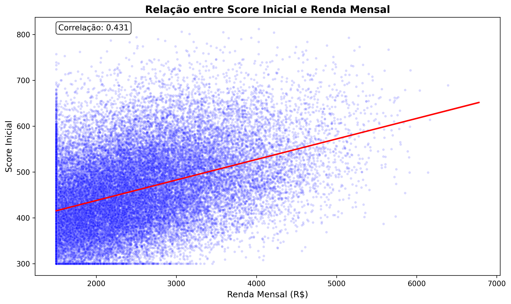
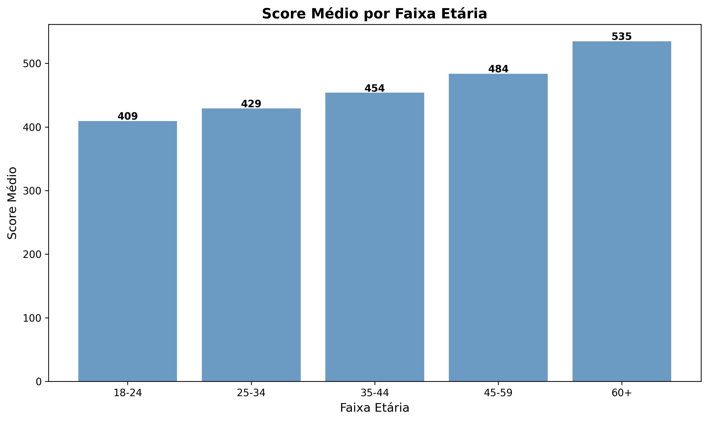
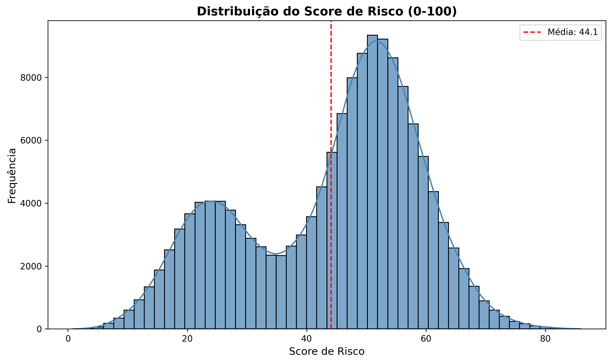
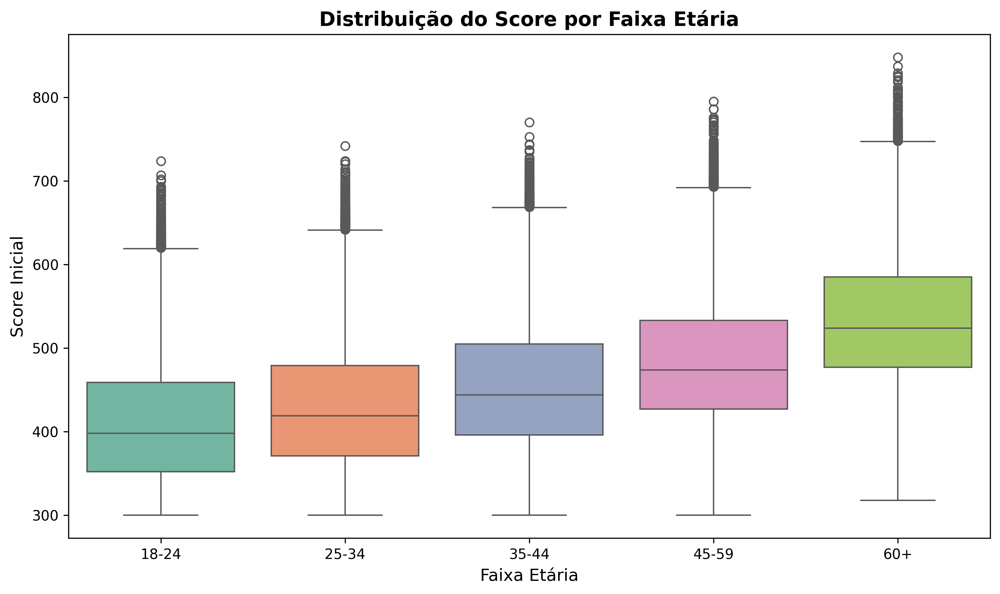

# Desafio Neurotech - Análise de Risco de Crédito e Segmentação de Clientes

## 📋 Visão Geral do Problema

Este projeto apresenta uma análise completa de risco de crédito e segmentação de clientes para uma empresa financeira. O objetivo principal é desenvolver um sistema preditivo capaz de identificar clientes com maior probabilidade de inadimplência, permitindo à empresa otimizar suas políticas de crédito e maximizar a rentabilidade.

### Contexto do Negócio
A empresa possui uma base de 150.000 clientes com histórico de:
- Dados cadastrais e demográficos
- Campanhas de marketing
- Transações de compra
- Histórico de liquidação de débitos
- Reclamações e pré-negações

## 🎯 Perguntas de Negócio

### Perguntas Macro
1. **Como identificar clientes com maior risco de inadimplência?**
2. **Qual o impacto financeiro de diferentes políticas de crédito?**
3. **Como segmentar clientes para estratégias personalizadas?**
4. **Qual o potencial de receita incremental com clientes de baixo risco?**

### Perguntas Micro
1. Quais variáveis são mais preditivas para inadimplência?
2. Como a renda per capita se relaciona com o score de crédito?
3. Qual a distribuição de clientes por canal de captação?
4. Como o comportamento de compra varia entre diferentes perfis?
5. Qual a efetividade das campanhas de marketing por segmento?

## 📊 Indicadores Criados

### 1. Índice de Risco de Crédito
**Fórmula:**
```
Risco = 0.35×Score_Invertido + 0.15×(1-Renda_Per_Capita) + 0.05×N_Dependentes + 
        0.25×Flag_Inadimplência + 0.15×Atraso_Máximo + 0.05×(1-Frequência_Compras)
```

**Classificação:**
- **Baixo Risco:** 0.00 - 0.33
- **Médio Risco:** 0.34 - 0.66  
- **Alto Risco:** 0.67 - 1.00

### 2. Features Preditivas
- **Recência de Compra:** Dias desde a última compra
- **Volatilidade de Gastos:** Desvio padrão dos valores de compra
- **Percentual Médio de Pagamento:** Proporção média paga das faturas
- **Renda Per Capita:** Renda mensal / (dependentes + 1)

### 3. Segmentação de Clientes
- **Traditional:** Clientes mais velhos, maior score, ideais para limites altos
- **Potential:** Score intermediário, limites moderados
- **Digital:** Mais jovens, menor score, foco em engajamento

## 🤖 Análise Preditiva

### Modelos Desenvolvidos
1. **Regressão Logística** (Baseline)
   - AUC: 0.6644
   - Interpretabilidade alta
   - Processamento rápido

2. **Random Forest** (Modelo Escolhido)
   - AUC: 0.6749
   - Melhor performance preditiva
   - Robustez a outliers

### Metodologia
- **Divisão:** 80% treino / 20% teste
- **Validação:** Estratificada por classe
- **Normalização:** StandardScaler para features numéricas
- **Encoding:** One-Hot para variáveis categóricas
- **Balanceamento:** class_weight='balanced'

## 💰 Impacto Financeiro

### Cenários Analisados

#### 1. Concessão de 20% de Crédito Adicional (Baixo Risco)
- **Receita Incremental Potencial:** R$ 11.950,68
- **Estratégia:** Aumentar limites para clientes seguros

#### 2. Custo de Inadimplência (Médio Risco)
- **Custo Total:** R$ 12.130.336,65
- **Estratégia:** Monitoramento intensivo

#### 3. Custo de Inadimplência (Alto Risco)
- **Custo Total:** R$ 62.084.131,64
- **Estratégia:** Restrição de crédito ou cobrança preventiva

#### 4. Prejuízo Futuro Estimado (Modelo Preditivo)
- **Alto Risco Preditivo:** R$ 64.881.670,73
- **Clientes Identificados:** 44.992 (30% da base)

## 📈 Principais Insights

### Perfil de Risco
- Clientes com **menor renda per capita** e **maior número de dependentes** apresentam maior risco
- **Score inicial baixo** é forte preditor de inadimplência
- **Histórico de atraso** é o fator mais crítico (peso 0.25 no índice)

### Segmentação Efetiva
- **Traditional (30%):** Foco em produtos premium
- **Potential (40%):** Oportunidade de upgrade
- **Digital (30%):** Estratégias de engajamento digital

### Oportunidades de Negócio
- **Receita Incremental:** R$ 11.950,68 com baixo risco
- **Prevenção de Perdas:** R$ 64.881.670,73 identificados pelo modelo
- **ROI do Modelo:** Potencial economia de milhões em inadimplência

## 🛠️ Tecnologias Utilizadas

- **Python 3.x**
- **Pandas** - Manipulação de dados
- **NumPy** - Computação numérica
- **Scikit-learn** - Machine Learning
- **Matplotlib/Seaborn** - Visualização
- **Jupyter Notebook** - Desenvolvimento interativo

## 📁 Estrutura dos Dados

```
├── CADASTRAL.csv      # Dados demográficos e cadastrais
├── CAMPANHAS.csv      # Histórico de campanhas de marketing
├── COMPRAS.csv        # Transações de compra
├── LIQUIDADOS.csv     # Histórico de pagamentos
├── PRE_NEGADOS.csv    # Pré-negações de crédito
└── RECLAMACOES.csv    # Reclamações de clientes
```

## 🚀 Próximos Passos

1. **Implementação em Produção**
   - Deploy do modelo Random Forest
   - Sistema de scoring em tempo real
   - Dashboard executivo

2. **Melhorias do Modelo**
   - Teste de algoritmos avançados (XGBoost, LightGBM)
   - Feature engineering adicional
   - Validação temporal

3. **Estratégias de Negócio**
   - Políticas de crédito personalizadas
   - Campanhas segmentadas
   - Sistema de alertas preventivos

## 📊 Resultados Principais

- **Modelo Preditivo:** AUC de 0.6749 (Random Forest)
- **Segmentação:** 3 perfis distintos identificados
- **Impacto Financeiro:** R$ 64.8M em risco identificado
- **Oportunidade:** R$ 11.9K em receita incremental segura

## 📈 Visualizações dos Dados

### 1. Relação entre Score e Renda Mensal

*Análise da correlação entre score inicial e renda mensal dos clientes*

### 2. Score Médio por Faixa Etária

*Demonstra que clientes mais velhos tendem a ter scores mais altos*

### 3. Distribuição do Score de Risco (0-100)

*Histograma mostrando a distribuição do índice de risco calibrado*

### 4. Boxplot: Score por Faixa Etária

*Visualização detalhada da distribuição de scores por grupo etário*


---

*Este projeto demonstra como análise de dados e machine learning podem transformar decisões de crédito, reduzindo riscos e maximizando oportunidades de negócio.*